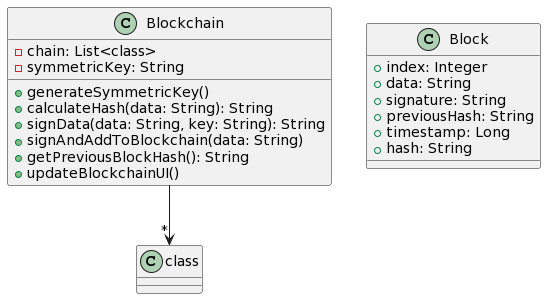

# Blockchain Demo

## Introduction

Blockchain Demo is a web application that provides an interactive demonstration of the basic concepts of a blockchain. The demo is implemented using HTML, CSS, and JavaScript, with cryptographic operations handled by the `jsrsasign` library for RSA key generation and signing.

The application allows users to generate RSA key pairs, sign transactions using private keys, and add new blocks to the blockchain. The visual representation of the blockchain with linked blocks helps users understand the core principles of blockchain technology.

## Architecture

## Features

- Generate RSA key pairs (Public Key and Private Key).
- Sign transactions using the generated Private Key.
- Add new blocks to the blockchain with signed transactions.
- Visual representation of the blockchain with blocks linked together.
- Learn about blockchain concepts, including hashing, linking blocks, and immutability.

## Prerequisites

To run the Blockchain Demo locally, you need:

- A modern web browser that supports JavaScript.

## Getting Started

Follow these steps to get started with the Blockchain Demo:

1. Clone the repository to your local machine:

2. Open the `index.html` file in your web browser.

## How to Use

1. Click on the "Generate RSA Keys" button to create RSA key pairs (Public Key and Private Key).

2. Enter some data in the input field and click on the "Sign and Add to Blockchain" button to sign the transaction and add a new block to the blockchain.

3. The newly added block will appear in the blockchain display below, along with its relevant details.

4. Repeat the process to add more blocks to the blockchain and observe how each block is linked to the previous one.

## Technologies Used

- HTML: Provides the structure of the web application.
- CSS: Styles and layouts the web application.
- JavaScript (jsrsasign library): Used for RSA key generation and signing.
- JavaScript (Custom): Implements blockchain creation, hashing, and block addition.

## Contributing

Contributions to the Blockchain Demo are welcome! If you find any issues or want to enhance the functionality, please submit a pull request.

1. Fork the repository.
2. Create a new branch for your feature or bug fix.
3. Make your changes and commit them.
4. Push your changes to your fork.
5. Submit a pull request.

## License

This project is licensed under the MIT License - see the [LICENSE](LICENSE) file for details.

## Acknowledgments

Special thanks to the jsrsasign library for providing cryptographic functionalities.

## Disclaimer

This is a educational project and meant for demonstration purposes only. It is not suitable for production use and does not provide real security. Use it at your own risk.
